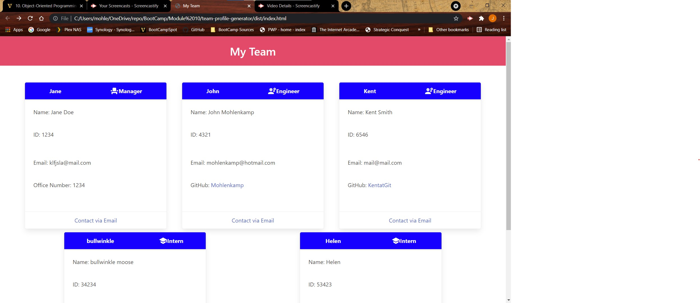

# team-profile-generator

## John Mohlenkamp
## June 20, 2021

## GitHub Location: https://github.com/Mohlenkamp/team-profile-generator

## GitPages Location: n/a

## Walkthrough Video(s): 

Part 1: https://drive.google.com/file/d/1152-ep72ce8Ijr0o7F_6Rhy6XHSL6Z9f/view

## Description 

This is an automated team-profile-generator program that uses Node.js to create an index.html file used
display a project team. You can start the program using 'node index.js'. 

After creating a manager following the prompts from Inquirer, the user is presented with the options of adding additional engineers and/or interns to the team. If an engineer is chosen, the Github username is also a hyperlink to their Github profile which will open in a new tab. All users also have an email link below their card which will auto-populate the To: line in the user's default mail program. 

Jest TDD tests are available using the 'npm run test' option. There are 4 test suites with 8 tests total and they are all located in the __tests__ directory. I tried different approaches to the test where some were more modular and some were more all-encompassing, just to see. 

